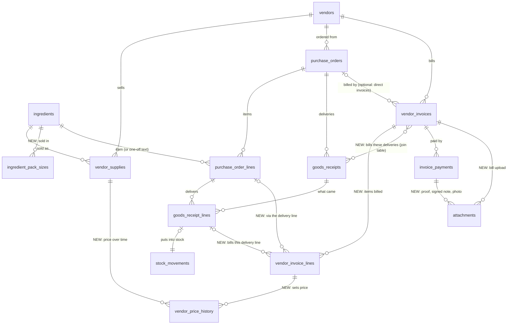

# Procurement redesign — decisions so far (discussion, not yet a build)

Rajeev and Claude, 2026-09-19. **Nothing here is built.** Building starts only when Rajeev says "build".
Each line is his decision, or a point still open.

## Prices
- Invoices get **item lines** (unit price per item), pre-filled from the order and delivery quantities. The price is recorded there, not at the delivery. *(Claude's recommendation; Rajeev leaned this way; confirm.)*
- A vendor's price for an ingredient is called **"List price"** (renamed from "Last price"). It is updated from each invoice.
- **Price history** is kept for every price with its date. Up/down/unchanged arrows beside the list price. The small trend chart comes **after UAT**, once real data exists.
- Open: arrow colours (red up / green down) conflict with the colour rule. Claude recommends an explicit exception for price trends.

## Vendors ↔ ingredients
- **Vendor page:** a second table under the vendor's supplies lists all ingredients the vendor doesn't supply yet, with inline List price, Lead time and Preferred. Tick, then Save, and they move up into the supplies table. Needs search and a category filter (about 200 rows).
- Remove "Edit a row to change any of the three."
- **Ingredient page:** a vendor dropdown to link it to a vendor from that side.
- Open: one preferred vendor per ingredient (Claude recommends yes, with "replaces X" shown).

## Shopping list
- Quantities show in kg/L from 1,000 up, rounded **up** to a buying step (under 1 kg: 50 g; 1–10 kg: ½ kg; 10–100 kg: 1 kg; over 100 kg: 5 kg). *(Proposed; a partial build was reverted; code kept aside.)*
- **Pack sizes per ingredient** ("Sold in": e.g. 250 g / 500 g / 1 kg). The suggestion is the fewest packs with the least left over. Wanted **before the demo** (Rajeev).
- **"No vendor yet"** lines: choose a vendor on the line ("Use this vendor next time"), plus bulk "Order these from…". Open: whether the temple buys some items at the market for cash (a market list).

## Purchase orders
- "Raise an order" → **"Create a purchase order"**. It goes straight to the form; the vendor-picker page is removed.
- Vendor dropdown beside **Needed by**; the **Deliver to** box is removed. The vendor note becomes an expandable textarea. "Lines" becomes **"Items"**. No "Nothing on this order yet."
- How items are added: **mock T-245** at /dev-po (designs A–D). Rajeev to pick.
- Existing order: remove **"Fixed when the order was sent"**. **One merged table**: Item · Ordered · Delivered · Rejected on delivery · Returned, with a per-item "Delivered" button, dated sub-lines for partial deliveries, and "Record the whole delivery". "Rejected at the gate" becomes **"Rejected on delivery"**.

## Deliveries (new)
- A dedicated **Deliveries** screen and menu item in Ordering, after Purchase orders. Expected / Partly delivered / Received. One "Record a delivery" per vendor, covering everything they still owe across open orders. **No prices.** Mock T-246 at /dev-deliveries.
- Deliveries are **recorded here**. The order page shows the history, with a link across.
- Dates always show as dates; today's gets a **blue "Today" pill** (info tone, Rajeev 2026-09-19, chosen over green because green means only "your own action worked"). Late ones stay amber.
- Partial deliveries: the rest is recorded with the same vendor "Record a delivery" ("still to come" is filled in). Each item has a collapsed "▸ N deliveries" history (date · received · rejected + reason · received by · order), shown in Partly delivered, Received and on the order.
- Access: a new **permission** (e.g. RECEIVE_DELIVERIES) for Temple Admin and Kitchen Manager, optionally Kitchen Staff. **Not a new Storekeeper role** (Rajeev, 2026-09-19).

## Invoices
- "Raise…" becomes **"Create an invoice"**, which opens the form directly.
- "Scan reference" becomes a **mandatory upload** (photo, PDF or scan; camera on a phone). No invoice without proof.
- **Vendors usually bill per delivery** (Rajeev, 2026-09-19). So an invoice links to **the delivery (or deliveries) it bills**, not just the order. Its lines are pulled from what that delivery brought, locked (no adding or removing; an unbilled item stays at 0; extras go in Other charges with a note, or a separate direct invoice). Direct invoices (no order) add items by hand.
- The Deliveries → Received tab marks each delivery **"Not billed yet"**, with **Create invoice** right there.
- Price: the **line amount is required; the rate is calculated** (read-only). *(Claude's recommendation; Rajeev to confirm after the mock.)*
- **Totals must add up:** items + GST + other charges − discount = the bill total, or it won't save (red). Billed more than delivered gives an amber warning.
- **Pay from the invoice** ("Pay this invoice"). **The Payments menu item and page (/money) are removed** (Rajeev, 2026-09-19). Its only job, unpaid invoices by age and the total owed, moves to the Invoices list as filters (Unpaid · Due this week · 1–30 days overdue · 31+ days overdue), with the total owed at the top.
- "Pay this invoice" is shown **only to people allowed to pay** (today the Temple Admin, the same permission the Payments page used). Moving it must not widen who can pay vendors.
- **Design A (Classic) chosen**, with B's bill-style totals block fused in, **right-aligned like a real bill**: Sub total · GST · Other charges · Discount · **Grand total** (Rajeev, 2026-09-19).
- Payments: "Recorded by" becomes **"Paid by"**. **Recording a payment needs mandatory proof** (receipt, UPI screenshot or bank confirmation), for vendor disputes (Rajeev).
- The totals check: a **green tick** beside Grand total when it adds up; otherwise one short red line ("Adds up to ₹1,030, not ₹1,000") that blocks saving.
- **Cash payments:** proof = a photo of a **note signed by the person receiving the cash**, plus a **photo of their ID card or of the person** (any photo that lets us recognise who took the money; no ID-type field) and their name. Staff are told this in training (Rajeev, 2026-09-19). UPI/bank/cheque: one proof upload.
- Mock T-247 at /dev-invoices.

## Data
- An **ultra-realistic 1–3 month simulation** of a real temple, run through the app itself on a moving clock (inventory, recipes, vendors, meal plans, shopping lists, orders, deliveries, invoices, sister kitchens, requests, issues…). It runs after the procurement changes, before UAT. It replaces staging data, needs a backup first and Rajeev's explicit go-ahead.

## Timing
- Demo about 9 AM IST, 20 September. Claude's view: pack sizes and small visible fixes before the demo if Rajeev says build; the rest right after, before UAT.

## How the records link (database foreign keys)
Checked against the migrations (V24, V26–V28, V40) on 2026-09-19. Solid lines exist today; **NEW** marks tables from this redesign. Every table also has `tenant_id → tenants` and row-level security.

- The **shopping list is derived**, not stored (V121), so nothing points back to it. By design.
- `vendor_invoice_lines.receipt_line_id` (the delivery line billed) makes billed-vs-delivered exact per delivery, and several invoices against one order safe.
